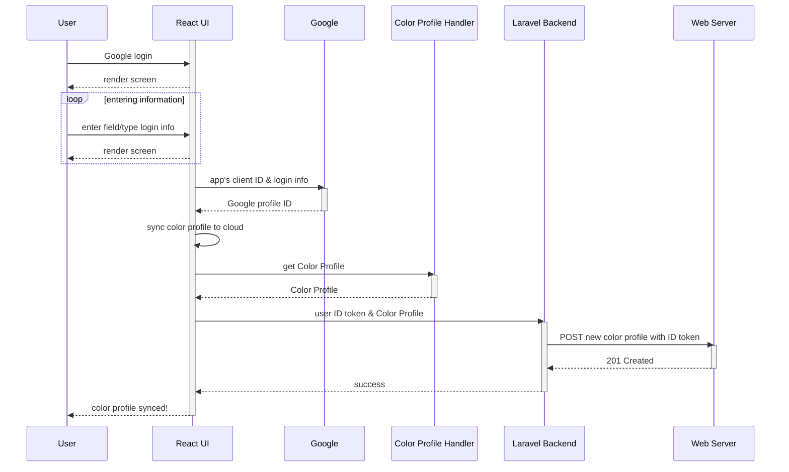
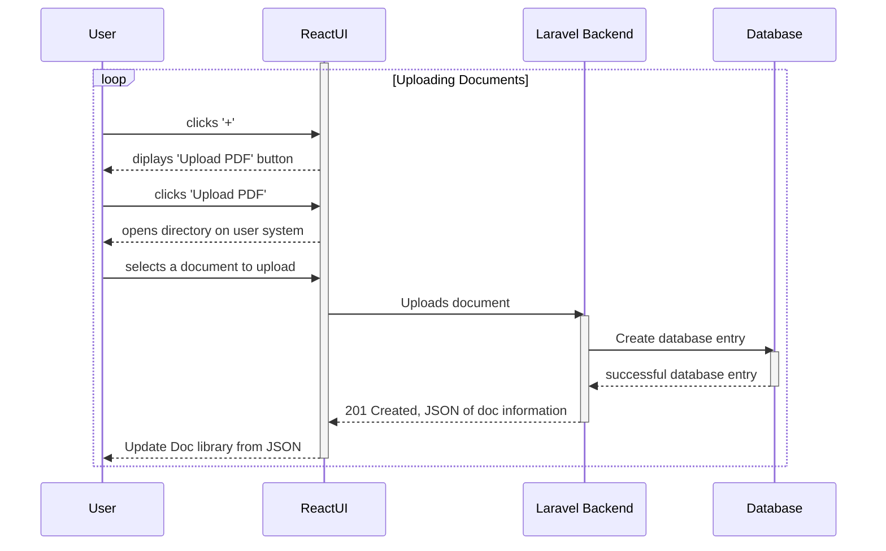
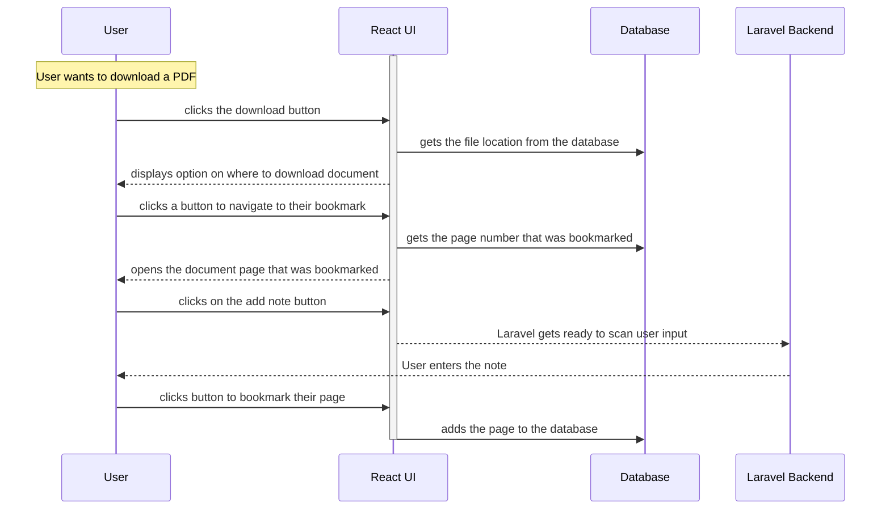
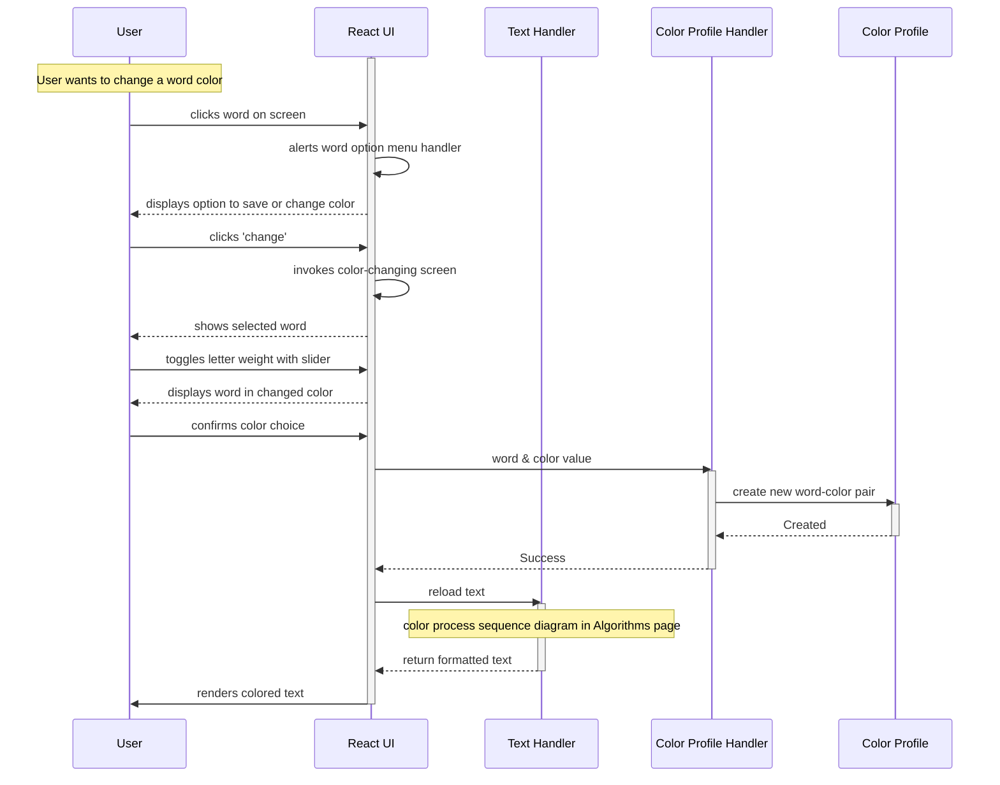
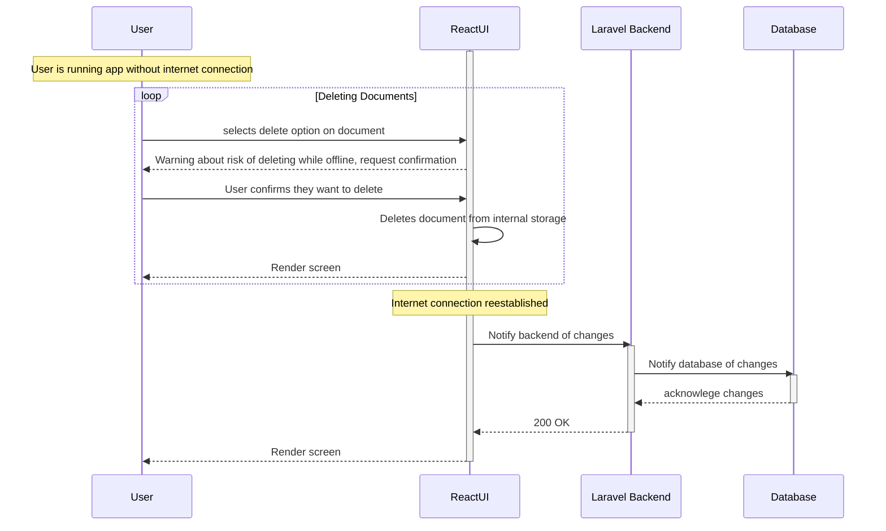
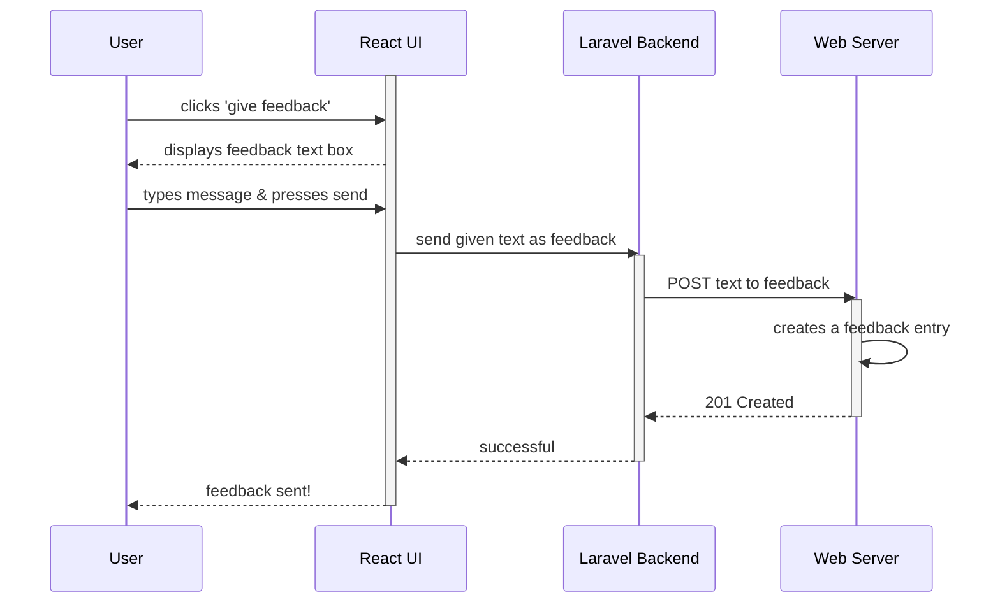

# Use-case descriptions

## Use Case 1: User creates an account

As a user, I want to create an account in order to use the same color profile and documents across devices
   1. User clicks "Google Login"
   2. User enters account info --> login with Google*
   3. Color profile is automatically synced to the web server

## Use Case 2: User uploads a document

As a user, I want to upload a PDF so that I can be able to access it within the app.
   1. From the document library page, clicks the '+' button
   2. UI displays a dialogue with the 'Upload PDF' button
   3. A file directory opens
   4. The user picks the file they wish to upload from said directory
   5. The PDF file is now available to open from the app library.

## Use Case 3: User reads offline

   1. On the device they want to use offline, the user selects the 'Download' option for a document while still online.
   2. Later, the user opens the app offline and opens the downloaded document
   3. The user clicks on the navigation icon and selects the latest bookmark, taking them to the correct page.
   4. The user reads and creates a note.
   5. The user corrects a word color.
   6. Eventually, the user finishes for now, bookmarks their page, and closes the application.
   7. When the device is connected to internet, the bookmark, color alteration, and note are synced in the background.

## User Case 4: User alters a word color
   1. While reading, the user comes across a word color they wish to change.
   2. User clicks on the word.
   3. Options to 'save' or 'change' come up.
   4. User clicks 'change'.
   5. The selected word is shown large on the screen.
   6. The user clicks on a letter, and then uses a slider to adjust the selected letter's weight.
   7. The user confirms the color change.
   8. The word color is saved to the user's color profile.
   9. The colors of the currently-loaded text are re-calculated and re-rendered as described on the algorithms page.

## User Case 5: User deletes document from device while offline
   1. document library page, selects a document and clicks the option to delete from device
   2. A pop-up message warns the user that if the document is deleted while disconnected from the internet, any annotations created since the last sync will be lost and gives the user the option to cancel.
   3. The user confirms that they want to delete.
   4. The document and associated annotations are deleted from the device.

## Use Case 6: User provides feedback to the developers
   1. User clicks on the 'give feedback' link in the app main menu.
   2. A text box is provided.
   3. The user types the feedback and hits 'submit'.
   4. The user is sent back to the app home page.

## Use Case 7: User calibrates color profile

As a new user, I want to personalize my reading experience by setting my preferred color calibration for letters and numbers.
1. User is directed to create their color profile
2. User selects letter-color associations using a color picker
3. User selects number-color associations using a color picker
4. User selects punctuation-color associations using a color picker
5. Requests that the user confirms their associations
6. User picks between a series of binary options to determine letter weight for the color algorithm.
7. Sample passage is provided for user to adjust calibration settings
8. Request user to confirm their calibration and hit "Done"
9. Directs user to the home page.
