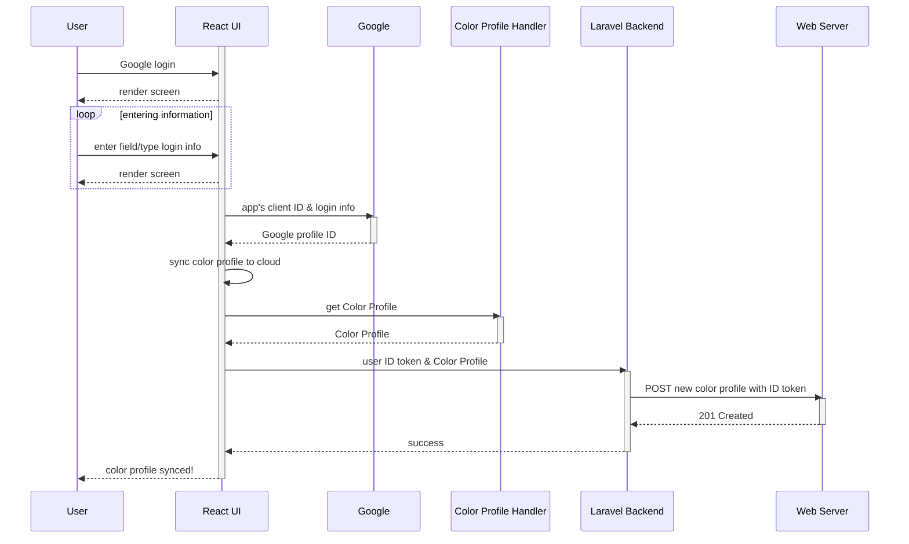
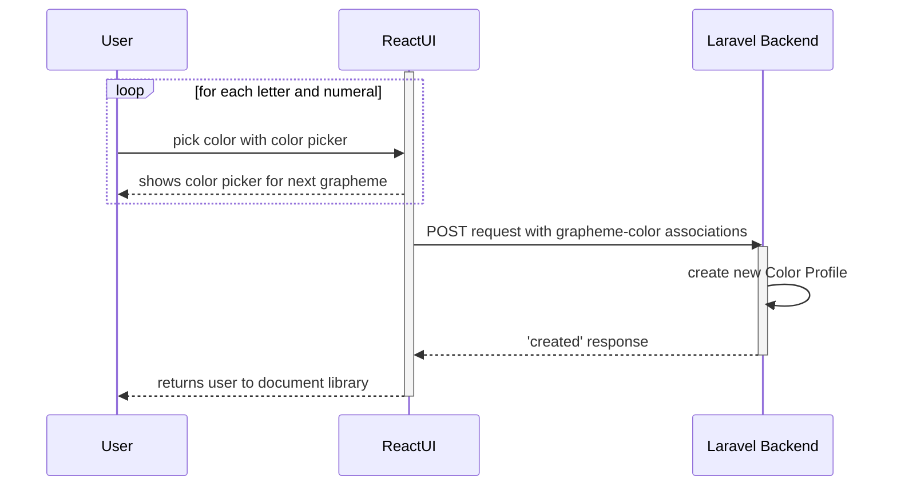
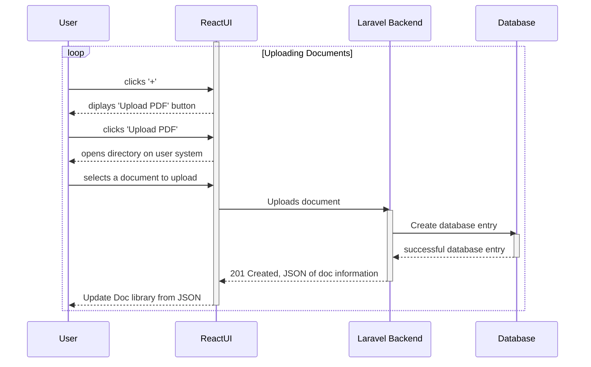
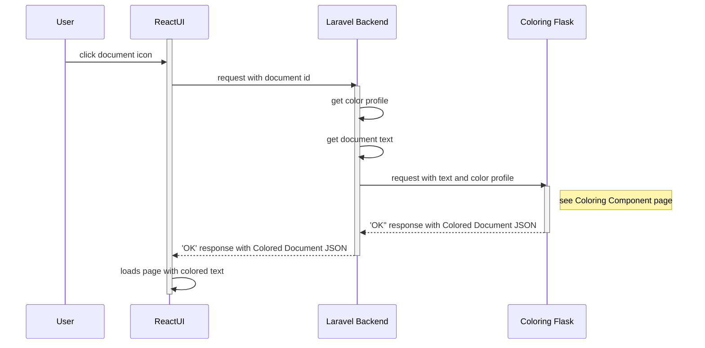

# Use-case descriptions

## Use Case 1: User creates an account

As a user, I want to create an account in order to use the same color profile and documents across devices
   1. User clicks "Google Login"
   2. User enters account info --> login with Google*
   3. Color profile is automatically synced to the web server

## Use Case 2: User calibrates color profile

As a new user, I want to personalize my reading experience by setting my preferred color calibration for letters and numbers.
1. User is directed to create their color profile
2. User selects letter-color associations using a color picker
3. User selects number-color associations using a color picker
4. Sends grapheme-color associations to backend
5. Directs user to the home page.

## Use Case 3: User uploads a document

As a user, I want to upload a PDF so that I can be able to access it within the app.
   1. From the document library page, clicks the '+' button
   2. UI displays a dialogue with the 'Upload PDF' button
   3. A file directory opens
   4. The user picks the file they wish to upload from said directory
   5. The PDF file is now available to open from the app library.

## Use Case 4: Reader Opens a Document
As a user, I want to read an uploaded document
    1. From the document library page, I click a document icon
    2. UI displays the document in my colors

