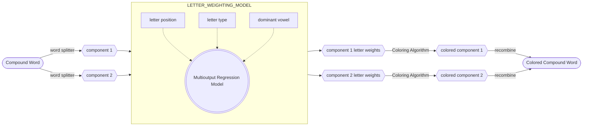
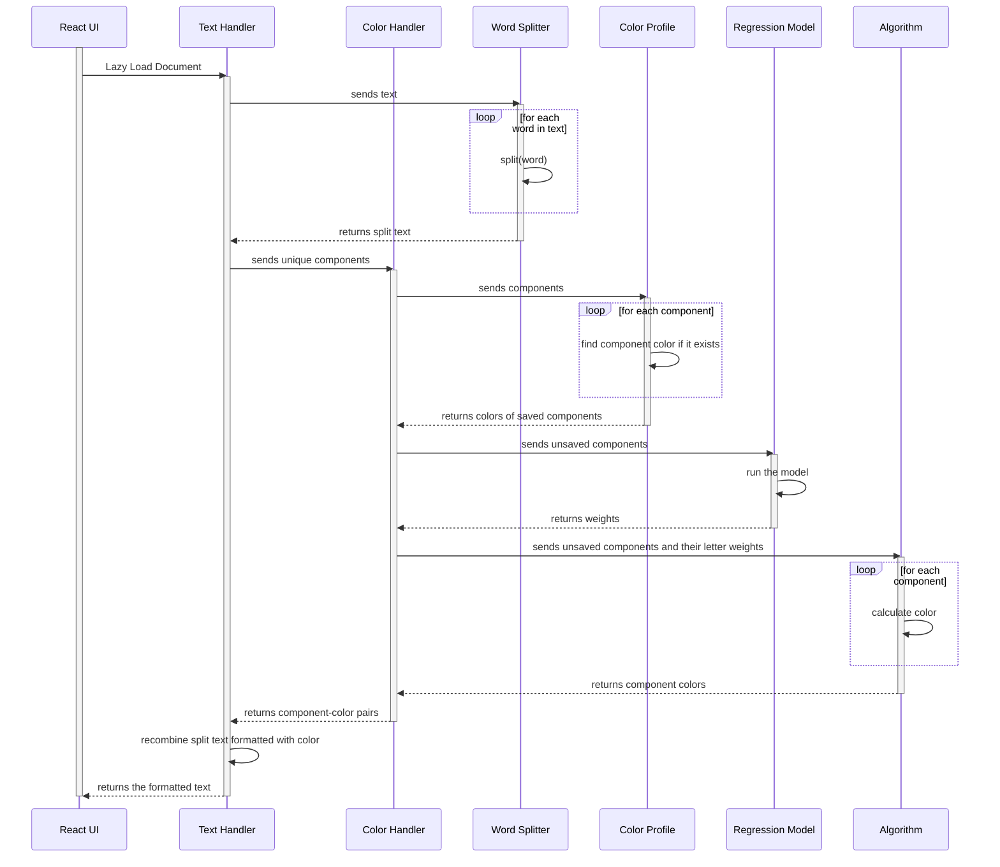

# Algorithms
The Synesthesia Reading App uses a series of algorithms to render words in a synesthete's colors.

### Coloring Process Overview

#### 1. Separating Monomorphic Components
First, each word is split using [Tim Kam's compound-word-splitter for Python](https://github.com/TimKam/compound-word-splitter), 
which separates compound words into their component, monomorphemic words. If the word splitter 
cannot find component words, i.e. the word is not compound, the entire words is fed into 
the letter weighting model in one piece.

#### 2. Determining Letter Weights
Next, each monomorphic component is put through a multioutput regression model. 
The model for determining letter weights is made in Python using PyTorch and
then converted to TensorFlow Lite in order to run on the user's device. It 
takes in letter features such as letters' position within the component and their 
type (vowel or consonant) and outputs the weight of each letter within the component.

#### 3. Coloring a Monomorphemic Word or Word Component
Then, the coloring algorithm for a component is run with the determined weights. 
A monomorphemic word/component will be colored using a weighted average of the
RGB values of each letter, where $1 = \sum_{1}^{n}\mathrm{w}_{i}^{}$ and $n$ is the 
number of letters within the component.

$$
Average\ R: \mathrm{w}_{1}^{} * \mathrm{R}_{1}^{} \ +\ \mathrm{w}_{2}^{} * \mathrm{R}_{2}^{} \ +\ \mathrm{w}_{3}^{} * \mathrm{R}_{3}^{} \ +\ ... \ +\ \mathrm{w}_{n}^{} * \mathrm{R}_{n}^{}

\\
Average\ G:\ \mathrm{w}_{1}^{} * \mathrm{G}_{1}^{} \ +\ \mathrm{w}_{2}^{} * \mathrm{G}_{2}^{} \ +\ \mathrm{w}_{3}^{} * \mathrm{G}_{3}^{} \ +\ ... \ +\ \mathrm{w}_{n}^{} * \mathrm{G}_{n}^{}

\\
Average\ B:\ \mathrm{w}_{1}^{} * \mathrm{B}_{1}^{} \ +\ \mathrm{w}_{2}^{} * \mathrm{B}_{2}^{} \ +\ \mathrm{w}_{3}^{} * \mathrm{B}_{3}^{} \ +\ ... \ +\ \mathrm{w}_{n}^{} * \mathrm{B}_{n}^{}
$$

### Sequence Diagram
The coloring process occurs on the user's device and is called 
when a document is loaded or when a user adjusts the color 
of a word.

