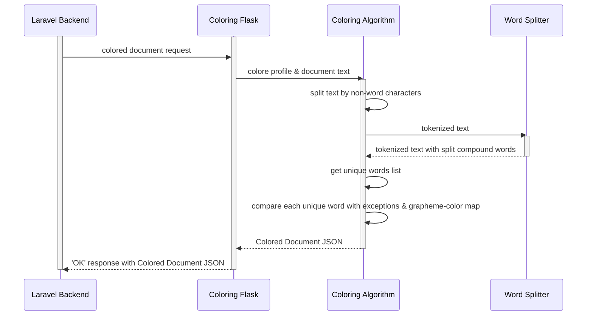

# Coloring Component
The Synesthesia Reading App uses a siloed Python flask to tokenize and color document text. This flask is given a coloring request with the text of a document and the Color Profile of a user
 and returns the information necessary to render a colored document.

### Coloring Process Overview

#### 1. Tokenizing the Text
First, the document text is split wherever there are non-letter or -number characters. So, wherever there is 
a space or a new line or punctuation, etc. Instead of a string of text, it is now a list with entries of words and individual, non-word characters.

#### 2. Separating Monomorphic Components
Then, each word item in the list is split into its component, monomorphemic words 
using an algorithm based off of [Tim Kam's compound-word-splitter for Python](https://github.com/TimKam/compound-word-splitter). The program uses
[this JSON of Webster's English Dictionary](https://github.com/matthewreagan/WebstersEnglishDictionary) to determine
if components are words.
If the word splitter 
can find smaller component words, i.e. the item is a compound word, each component becomes its own item in the list, but 
with no space item between them.

#### 3. Parse the Color Profile
From the color profile sent to the flask, the program extracts a grapheme-color map and a exception map. 
The grapheme-color map has the color value for each letter and number, while the exception map contains the 
color values for words that are known exceptions to the coloring rules-- i.e., they are not the color of their initial letter.

#### 4. Get a List of Unique Text Items
Next, the program goes throught the list of tokenized text items and creates a list of only unique items.
 This ensures that it does not waste time determining the color a word multiple times.

#### 5. Creating a Color Map
The algorithm creates a map of each unique text component to its color value by going through the unique word list.
 First, it checks if a component is in exception map. If so, if assigns it the color found there. If not, 
it takes the first letter of the component and gets the color value from the grapheme-color map.
Each component-color pair is added to the word-color map.

#### 6. Package to Send Back to Laravel Backend
The flask program creates an object with 2 components: the tokenized text and the word-color map. Finally, 
this object is converted to JSON format, which allows it to be sent back to the Laravel Backend.

### Sequence Diagram
The coloring process occurs on the user's device and is called 
when a document is loaded or when a user adjusts the color 
of a word.

