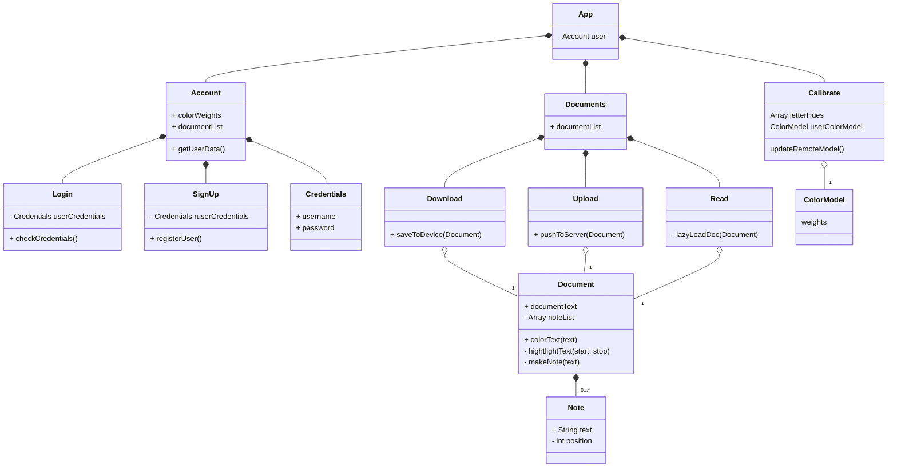
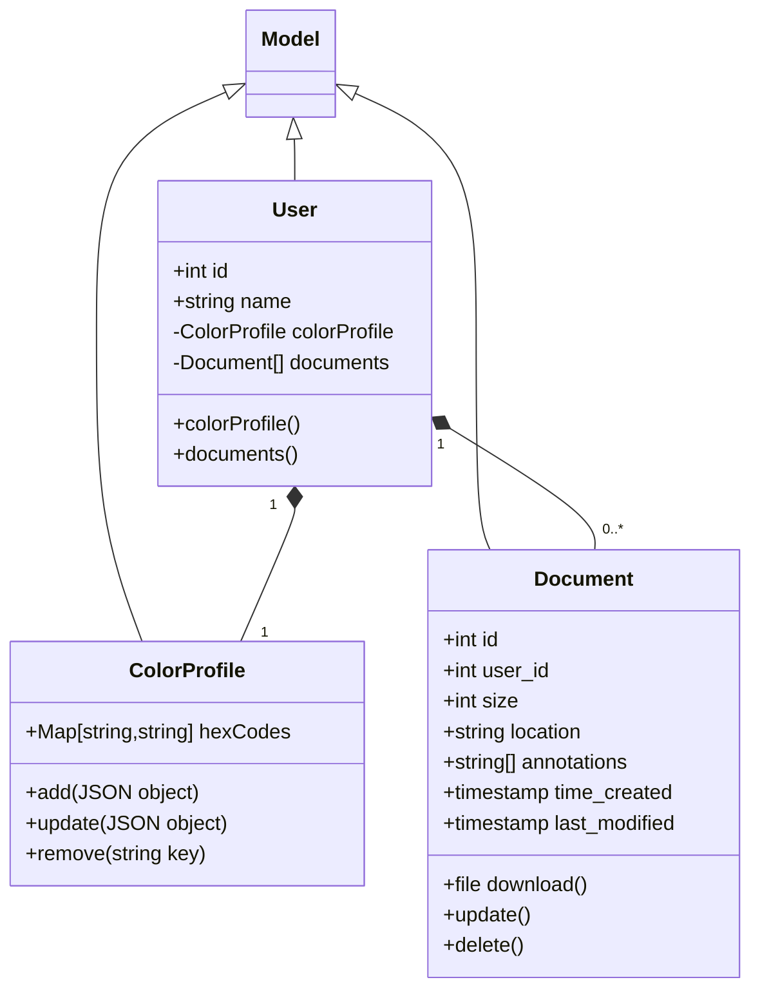

# Design

## User-Interface

### Technology - User-Interface

User-Interface created using ReactJS, Tailwind, and mUI. Front-end scripting executed using ReactJS.

### Class Diagram - User-Interface

### Design Mock-Ups

Welcome, Login, & Sign Up Screens

| Welcome     | Login       | Sign Up   |
| ----------- | ----------- | --------- |
|  |  |  |

Document Library Screen

Document Reading Screen

| Reading | Tap to bring up Menu |
| ------- | -------------------- |
|  |  |

## Backend API

### Technology - Backend

Backend API written in PHP using the Laravel framework.

### Class Diagram - Backend

