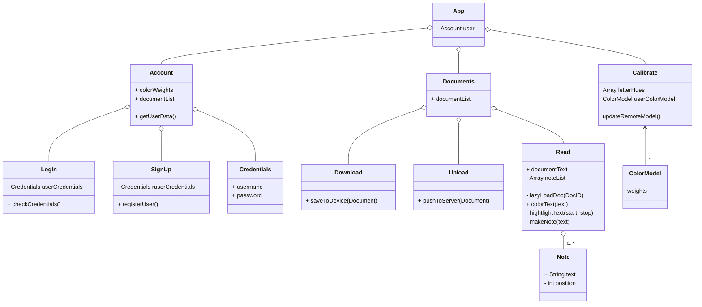

## User-Interface

### Technology
User-Interface created using ReactJS, Tailwind, and mUI. Front-end scripting executed using ReactJS. 

### Class Diagram

### Design Mock-Ups

Welcome, Login, & Sign Up Screens

  
  
  

 
 

Document Reading Screen

