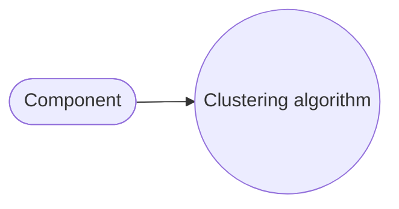

# Algorithms
The Synesthesia Reading App uses a series of algorithms to render words in a synesthete's colors.

### Creation and Deployment
The models for determining letter weights are made in Python using PyTorch and 
then converted to TensorFlow Lite in order to be run on the user's device.

### Separating Monomorphic Components
First, each word yet to be assigned a color is run through [Tim Kam's compound-word-splitter for Python](https://github.com/TimKam/compound-word-splitter), 
which separates compound words into their component, monomorphemic words.

### Determining Letter Weights
Next, the weighting of each letter for a component's coloring algorithm is determined.
These weights are affected by letters' position within the component and their
type (vowel or consonant), based on the weights of letters of similar type
and position in other words.

### Coloring a Monomorphemic Word or Word Component
Finally, the coloring algorithm for a component is run with the determined weights.
A monomorphemic word/component will be colored using a weighted average of the
RGB values of each letter, where $1 = \sum_{1}^{n}\mathrm{w}_{i}^{}$ and n is the 
number of letters within the component.

$$
Average\ R: \mathrm{w}_{1}^{} * \mathrm{R}_{1}^{} \ +\ \mathrm{w}_{2}^{} * \mathrm{R}_{2}^{} \ +\ \mathrm{w}_{3}^{} * \mathrm{R}_{3}^{} \ +\ ... \ +\ \mathrm{w}_{n}^{} * \mathrm{R}_{n}^{}

\\
Average\ G:\ \mathrm{w}_{1}^{} * \mathrm{G}_{1}^{} \ +\ \mathrm{w}_{2}^{} * \mathrm{G}_{2}^{} \ +\ \mathrm{w}_{3}^{} * \mathrm{G}_{3}^{} \ +\ ... \ +\ \mathrm{w}_{n}^{} * \mathrm{G}_{n}^{}

\\
Average\ B:\ \mathrm{w}_{1}^{} * \mathrm{B}_{1}^{} \ +\ \mathrm{w}_{2}^{} * \mathrm{B}_{2}^{} \ +\ \mathrm{w}_{3}^{} * \mathrm{B}_{3}^{} \ +\ ... \ +\ \mathrm{w}_{n}^{} * \mathrm{B}_{n}^{}
$$

